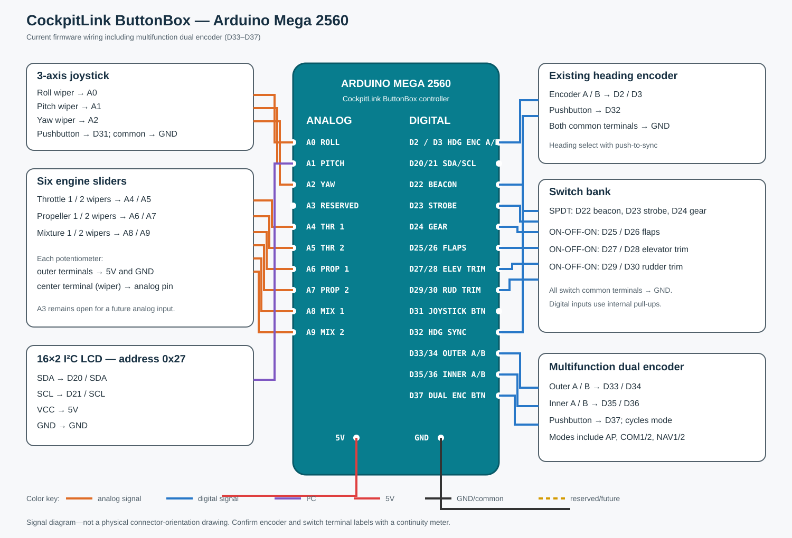

# ButtonBox Wiring

This is the current Arduino Mega 2560 wiring used by the ButtonBox example,
including the multifunction dual encoder on D33-D37.

## Pin assignments

| Mega pin | Device | Connection or function |
| --- | --- | --- |
| D2 | Heading encoder | A |
| D3 | Heading encoder | B |
| D20 / SDA | 16x2 I2C LCD | SDA, address `0x27` |
| D21 / SCL | 16x2 I2C LCD | SCL |
| D22 | SPDT switch | Beacon lights |
| D23 | SPDT switch | Strobe lights |
| D24 | SPDT switch | Landing gear handle; reversed in firmware |
| D25 / D26 | Momentary ON-OFF-ON | Flaps up / flaps down |
| D27 / D28 | Momentary ON-OFF-ON | Elevator trim down / up |
| D29 / D30 | Momentary ON-OFF-ON | Rudder trim left / right |
| D31 | Joystick pushbutton | Raw XYZ calibration display; future assignment |
| D32 | Heading encoder button | Heading sync |
| D33 / D34 | Dual encoder outer ring | A / B; coarse/altitude/airspeed functions |
| D35 / D36 | Dual encoder inner ring | A / B; fine/VS/course functions |
| D37 | Dual encoder button | Cycle multifunction mode |
| A0 | Joystick | Roll wiper |
| A1 | Joystick | Pitch wiper |
| A2 | Joystick | Yaw wiper |
| A3 | Reserved | Future analog control |
| A4 / A5 | Sliders | Throttle 1 / throttle 2 wipers |
| A6 / A7 | Sliders | Propeller 1 / propeller 2 wipers |
| A8 / A9 | Sliders | Mixture 1 / mixture 2 wipers |

All digital controls use the Mega's `INPUT_PULLUP`: connect their common
terminal to GND. No external pull-up resistor is required. For each SPDT switch,
use common and one throw; leave the unused throw disconnected. The common of
each ON-OFF-ON switch goes to GND and its two throws go to the listed pins.

For every potentiometer, connect the two outer terminals to 5V and GND and the
wiper to its analog pin. Swap the outer terminals if its physical direction is
opposite the desired value. Connect the LCD to 5V, GND, SDA/D20, and SCL/D21.

The multifunction modes are currently `HDG`, `ALT / VS`, `SPD / CRS`, `COM1`,
`COM2`, `NAV1`, `NAV2`, and `GNS1`. A short D37 press performs the current
mode's push action: sync for autopilot modes, active/standby swap for conventional
radios, or COM/NAV selection for GNS1. A 700 ms long press advances to the next
mode and the LCD briefly shows its name.
